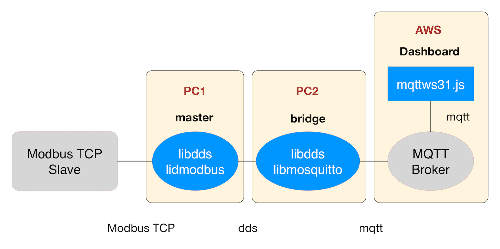

# dds-modbus

[](https://travis-ci.org/taka-wang/dds-modbus)



---

### Development dependencies

```bash
sudo apt-get update
sudo apt-get install git build-essential libssl-dev libwrap0-dev libc-ares-dev uuid-dev automake libtool cmake
```

### Install libmosquitto (MQTT Library)

```bash
wget http://mosquitto.org/files/source/mosquitto-1.4.8.tar.gz
tar zxvf mosquitto-1.4.8.tar.gz
cd mosquitto-1.4.8
make all
sudo make install
sudo ldconfig
```

### Install libmodbus (Modbus Library)

```bash
git clone https://github.com/stephane/libmodbus.git
cd libmodbus
./autogen.sh
./configure
make
sudo make install
sudo ldconfig
```

### Install DDS Library
Download [Vortex Lite](http://www.prismtech.com/vortex/software-downloads), then install it.

### Install MQTT broker (Optional)

```bash
# node.js mqtt broker
npm install mosca bunyan -g
```

### Build
```
git clone https://github.com/taka-wang/dds-modbus.git
cd dds-mosbus
mkdir build
cd build
cmake ..
make # master and bridge in build folder
```

### Run

```bash
# option: use your own mqtt broker
mosca -v --http-port 3000 --http-bundle --http-static ./ | bunyan # mqtt broker

# modbus <--> dds
./master

# dds <--> mqtt
./bridge
```

--- 

### Run Modbus Simulator
See [README](modbus/README.md)

### MQTT Test

```bash
# subscribe rotary value
mosquitto_sub -h 192.168.0.107 -d -t "/sensors/rotary/3"

# turn on led red
mosquitto_pub -h 192.168.0.107 -d -t /sensors/led/16 -m "1"

# turn off led red
mosquitto_pub -h 192.168.0.107 -d -t /sensors/led/16 -m "1"

# turn on led green
mosquitto_pub -h 192.168.0.107 -d -t /sensors/led/17 -m "0"

# turn off led red
mosquitto_pub -h 192.168.0.107 -d -t /sensors/led/17 -m "0"
```
---

### Note

You may test the programs with [Naive Dashboard](public) or [Node-Red](http://nodered.org/) with [MQTT Flow](node-red-flow.json).